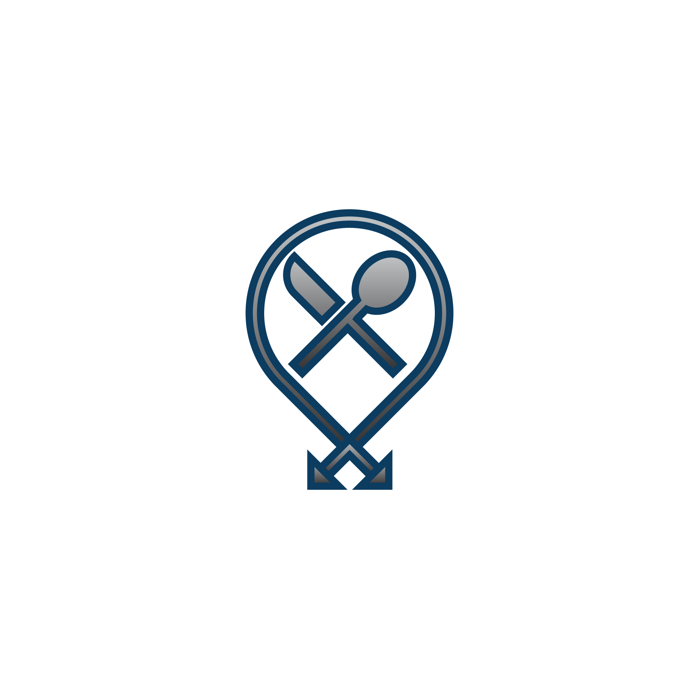

This project is a simple example of a personal project that I did to get to know Angular and Ionic (built in 2016). This is not a finished product, just a simple example project.

# Random Diner

Sometimes, students of University of Maribor would wander around the city, choosing which restaurant to go to and user their student coupons. In case you're one of those indecisive people, this is the app for you! Enter your favourite restaurants and we'll pick one at random. That's all!

